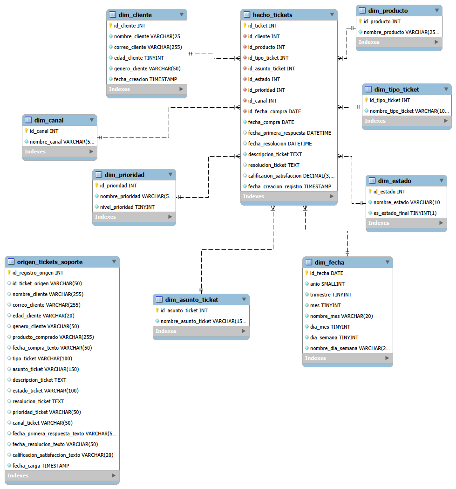

# Proyecto SQL: Análisis de Tickets de Soporte al Cliente

## 1. Descripción del proyecto

Este proyecto corresponde al módulo de SQL del programa de Data Science & IA.
El objetivo principal es diseñar, implementar y analizar una base de datos relacional a partir de un dataset de tickets de soporte al cliente.

El dataset original viene en formato CSV y contiene información sobre clientes, productos, tipos de tickets, prioridades, canales de atención, estados, fechas de respuesta, fechas de resolución y calificaciones de satisfacción.

A partir de una tabla plana inicial, se construyó un modelo relacional normalizado con una tabla principal de hechos y varias tablas de dimensiones. Posteriormente, se realizaron validaciones de calidad de datos y consultas analíticas para extraer insights de negocio usando SQL.

---

## 2. Objetivo del análisis

El objetivo del análisis es responder preguntas de negocio relacionadas con la operación de soporte al cliente, tales como:

* ¿Cuántos tickets existen por estado, prioridad y canal?
* ¿Qué productos generan mayor volumen de tickets?
* ¿Qué canales presentan menor satisfacción promedio?
* ¿Qué prioridades concentran mayor backlog?
* ¿Qué tipos de ticket tienen peor satisfacción?
* ¿Qué tickets cumplen o incumplen un SLA teórico según su prioridad?
* ¿Qué clientes generan múltiples tickets?

Este proyecto busca demostrar el uso de SQL no solo para consultar datos, sino también para diseñar un modelo relacional, transformar datos, validar calidad y generar información útil para la toma de decisiones.

---

## 3. Dataset utilizado

El dataset utilizado es:

**Customer Support Ticket Dataset**

El archivo original se encuentra en:

```text
data/raw/customer_support_tickets.csv
```

El dataset contiene:

* 8,469 tickets de soporte.
* Información de clientes.
* Productos comprados.
* Tipo y asunto del ticket.
* Estado del ticket.
* Prioridad.
* Canal de atención.
* Fechas de compra, primera respuesta y resolución.
* Calificación de satisfacción del cliente.

---

## 4. Estructura del repositorio

```text
Customer_Support_Ticket_Data_Project/
│
├── data/
│   └── raw/
│       └── customer_support_tickets.csv
│
├── sql/
│   ├── 01_schema.sql
│   ├── 02_data.sql
│   ├── 03_validation.sql
│   └── 04_eda.sql
│
├── docs/
│   └── modelo_relacional.png
│
├── README.md
└── .gitignore
```

---

## 5. Motor SQL utilizado

El proyecto fue desarrollado y probado con:

```text
MySQL 8
MySQL Workbench
```

---

## 6. Arquitectura del proyecto

El proyecto está dividido en cuatro capas principales:

### 6.1 Capa de origen

Tabla:

```text
origen_tickets_soporte
```

Esta tabla representa la carga inicial de datos crudos.
Su objetivo es conservar la estructura original del dataset antes de aplicar transformaciones.

En esta tabla, varios campos se almacenan inicialmente como texto para permitir validaciones posteriores, conversiones de tipo y detección de problemas de calidad.

---

### 6.2 Capa dimensional

Tablas de dimensiones:

```text
dim_cliente
dim_producto
dim_tipo_ticket
dim_asunto_ticket
dim_estado
dim_prioridad
dim_canal
dim_fecha
```

Estas tablas contienen atributos descriptivos del negocio, como clientes, productos, estados, prioridades y canales.

---

### 6.3 Capa de hechos

Tabla principal:

```text
hecho_tickets
```

Granularidad:

```text
Una fila representa un ticket individual de soporte.
```

Esta tabla contiene las métricas y claves foráneas necesarias para analizar los tickets desde diferentes perspectivas del negocio.

---

### 6.4 Capa analítica

Vistas de negocio:

```text
vista_detalle_tickets
vista_kpis_soporte
```

Estas vistas facilitan el análisis y evitan repetir joins complejos en múltiples consultas.

---

## 7. Modelo relacional

El modelo se diseñó a partir de una tabla plana de tickets de soporte.

La tabla principal `hecho_tickets` se conecta con las siguientes dimensiones:

```text
dim_cliente        -> información del cliente
dim_producto       -> producto comprado
dim_tipo_ticket    -> tipo general del ticket
dim_asunto_ticket  -> asunto específico del ticket
dim_estado         -> estado operativo del ticket
dim_prioridad      -> prioridad del ticket
dim_canal          -> canal de atención
dim_fecha          -> calendario asociado a la fecha de compra
```

Representación simplificada:

```text
dim_cliente          dim_producto          dim_tipo_ticket
     |                    |                       |
     |                    |                       |
     +------------- hecho_tickets ----------------+
     |                    |                       |
dim_estado          dim_prioridad           dim_canal
     |
dim_fecha
```

### Diagrama del modelo relacional



---

## 8. Justificación de normalización

El CSV original estaba desnormalizado porque cada fila repetía información de cliente, producto, canal, prioridad, estado y tipo de ticket.

Para mejorar el diseño, se separaron estos atributos en tablas de dimensiones y se dejó la tabla `hecho_tickets` como tabla principal de análisis.

Esta decisión permite:

* Evitar duplicidad innecesaria.
* Mejorar la integridad de los datos.
* Facilitar el uso de claves primarias y foráneas.
* Consultar el negocio desde diferentes dimensiones.
* Hacer el modelo más escalable y mantenible.

---

## 9. Scripts SQL

### 9.1 `01_schema.sql`

Este script crea desde cero la base de datos y su estructura relacional.

Incluye:

* Creación de base de datos.
* Tabla de origen.
* Tablas de dimensiones.
* Tabla de hechos.
* Primary Keys.
* Foreign Keys.
* Constraints.
* Índices.
* Vistas de negocio.
* Función personalizada para SLA.

La base de datos creada se llama:

```text
analitica_soporte_clientes
```

---

### 9.2 `02_data.sql`

Este script carga y transforma los datos.

Incluye:

* Carga del archivo CSV original en la tabla de origen mediante `LOAD DATA LOCAL INFILE`.
* Limpieza básica de campos.
* Conversión de tipos.
* Carga de dimensiones.
* Carga de la tabla de hechos.
* Uso de transacciones.
* Uso de `INSERT`, `UPDATE` y `DELETE`.

Importante: antes de ejecutar este script en MySQL Workbench, se debe modificar manualmente la ruta del archivo CSV en la línea `LOAD DATA LOCAL INFILE`.

El archivo CSV se encuentra dentro del repositorio en:

```text
data/raw/customer_support_tickets.csv
```

Cada persona que clone o descargue el proyecto debe reemplazar la ruta de ejemplo por la ruta absoluta del archivo en su propio computador.

Si MySQL Workbench muestra un error relacionado con `LOCAL INFILE`, se debe habilitar la opción `local_infile` en el servidor MySQL y también permitir `OPT_LOCAL_INFILE=1` en la conexión de MySQL Workbench. Los pasos detallados están en la sección **13. Cómo ejecutar el proyecto en MySQL Workbench**.

---

### 9.3 `03_validation.sql`

Este script valida la calidad de los datos.

Incluye validaciones sobre:

* Conteo de registros entre origen y hechos.
* Valores nulos.
* Tickets duplicados.
* Clientes con múltiples tickets.
* Correos con formato inválido.
* Edades fuera de rango.
* Calificaciones fuera de rango.
* Fechas inconsistentes.
* Tickets cerrados sin resolución.
* Outliers de tiempo de resolución.
* Dimensiones sin uso.

También crea una tabla resumen:

```text
resumen_validacion_calidad
```

---

### 9.4 `04_eda.sql`

Este script contiene el análisis exploratorio y las consultas de negocio.

Incluye:

* KPIs generales.
* Distribución de tickets por estado.
* Volumen por prioridad.
* Backlog por prioridad y canal.
* Satisfacción promedio por canal.
* Productos con menor satisfacción.
* Tipos de ticket por volumen y satisfacción.
* Tiempo promedio de resolución.
* Ranking de productos por volumen.
* CTEs encadenadas.
* Análisis de clientes recurrentes.
* Tendencia mensual.
* Cumplimiento de SLA.
* Consulta demo para presentación.
* Resumen final de insights.

---

## 10. Requisitos SQL cubiertos

Este proyecto utiliza los siguientes elementos de SQL:

* `CREATE DATABASE`
* `CREATE TABLE`
* `DROP DATABASE IF EXISTS`
* `DROP TABLE IF EXISTS`
* `PRIMARY KEY`
* `FOREIGN KEY`
* `UNIQUE`
* `CHECK`
* `DEFAULT`
* `INSERT`
* `UPDATE`
* `DELETE`
* `CAST`
* Funciones de fecha
* `COUNT`
* `SUM`
* `AVG`
* `GROUP BY`
* `ORDER BY`
* `HAVING`
* `INNER JOIN`
* `LEFT JOIN`
* Subqueries
* `CASE`
* CTEs con `WITH`
* CTEs encadenadas
* Funciones ventana con `RANK() OVER`
* Transacciones con `START TRANSACTION`, `COMMIT` y `ROLLBACK`
* Índices
* Vistas
* Función personalizada

---

## 11. Función personalizada

Se creó la función:

```text
fn_sla_prioridad_horas
```

Esta función devuelve las horas objetivo de resolución según la prioridad del ticket.

Regla de negocio aplicada:

```text
Critical -> 4 horas
High     -> 8 horas
Medium   -> 24 horas
Low      -> 48 horas
```

Esta función se utiliza en el EDA para analizar si los tickets cerrados cumplen o no cumplen un SLA teórico.

---

## 12. Índices creados

Se crearon índices sobre la tabla de hechos para mejorar consultas analíticas frecuentes.

Índices principales:

```text
idx_hecho_estado_prioridad
idx_hecho_producto
idx_hecho_canal
idx_hecho_fecha_compra
```

El índice `idx_hecho_estado_prioridad` es útil para consultas de backlog, ya que muchas preguntas de negocio filtran tickets por estado y prioridad.

---

## 13. Cómo ejecutar el proyecto en MySQL Workbench

Para ejecutar el proyecto desde cero en MySQL Workbench:

1. Descargar o clonar este repositorio.
2. Abrir MySQL Workbench.
3. Conectarse al servidor local de MySQL.
4. Abrir y ejecutar primero el script:

```text
sql/01_schema.sql
```

Este script elimina y recrea la base de datos `analitica_soporte_clientes`.

### 13.1 Configurar la ruta del CSV en `02_data.sql`

Antes de ejecutar `sql/02_data.sql`, abrir el archivo y buscar la línea que empieza con:

```sql
LOAD DATA LOCAL INFILE
```

La línea de ejemplo puede verse así:

```sql
LOAD DATA LOCAL INFILE 'C:/Users/TU_USUARIO/Downloads/Customer_Support_Ticket_Data_Project/data/raw/customer_support_tickets.csv'
```

Se debe reemplazar esa ruta por la ruta absoluta donde se encuentre el archivo `customer_support_tickets.csv` en el computador local.

El archivo está dentro del proyecto en:

```text
data/raw/customer_support_tickets.csv
```

### Ejemplo en Windows

Si el archivo se encuentra en esta ubicación:

```text
C:\Users\artur\OneDrive\Documents\Evolve\SQL\Customer_Support_Ticket_Data_Project\data\raw\customer_support_tickets.csv
```

En el script SQL se recomienda escribir la ruta usando `/` en vez de `\`:

```sql
LOAD DATA LOCAL INFILE 'C:/Users/artur/OneDrive/Documents/Evolve/SQL/Customer_Support_Ticket_Data_Project/data/raw/customer_support_tickets.csv'
```

También es válido usar doble barra invertida `\\`, pero es menos legible:

```sql
LOAD DATA LOCAL INFILE 'C:\\Users\\artur\\OneDrive\\Documents\\Evolve\\SQL\\Customer_Support_Ticket_Data_Project\\data\\raw\\customer_support_tickets.csv'
```

Importante: evitar mezclar barras en la misma ruta. Por ejemplo, no usar una ruta como esta:

```sql
LOAD DATA LOCAL INFILE 'C:\Users\artur\OneDrive\Documents\Evolve\SQL\Customer_Support_Ticket_Data_Project\data\raw/customer_support_tickets.csv'
```

### Ejemplo en macOS

Si el proyecto está en la carpeta `Documents`, la ruta podría verse así:

```sql
LOAD DATA LOCAL INFILE '/Users/arturo/Documents/Customer_Support_Ticket_Data_Project/data/raw/customer_support_tickets.csv'
```

En macOS se usa `/` de forma natural en la ruta.

### 13.2 Habilitar `LOCAL INFILE` en MySQL Workbench

El script `02_data.sql` usa:

```sql
LOAD DATA LOCAL INFILE
```

Si MySQL Workbench muestra un error como este:

```text
Error Code: 3948. Loading local data is disabled; this must be enabled on both the client and server sides
```

se debe habilitar la carga local en dos lugares: en el servidor MySQL y en la conexión de MySQL Workbench.

#### Paso A: habilitar `local_infile` en el servidor MySQL

En MySQL Workbench, abrir una pestaña nueva y ejecutar:

```sql
SHOW GLOBAL VARIABLES LIKE 'local_infile';
```

Si el valor aparece como `OFF`, ejecutar:

```sql
SET GLOBAL local_infile = 1;
```

Luego validar nuevamente:

```sql
SHOW GLOBAL VARIABLES LIKE 'local_infile';
```

El resultado esperado es:

```text
local_infile    ON
```

Si `SET GLOBAL local_infile = 1;` genera un error de permisos, conectarse con un usuario administrador, por ejemplo `root`.

#### Paso B: habilitar `LOCAL INFILE` en la conexión de MySQL Workbench

En MySQL Workbench:

```text
Database > Manage Connections
```

Seleccionar la conexión local y abrir la pestaña:

```text
Advanced
```

En el campo **Others**, agregar:

```text
OPT_LOCAL_INFILE=1
```

Guardar los cambios, cerrar la conexión actual y volver a conectarse.

### 13.3 Ejecutar los scripts en orden

Después de ajustar la ruta del CSV y habilitar `LOCAL INFILE`, ejecutar los scripts en este orden:

```text
sql/01_schema.sql
sql/02_data.sql
sql/03_validation.sql
sql/04_eda.sql
```

---

## 14. Verificación rápida

Después de ejecutar los scripts, se puede validar la carga con estas consultas:

```sql
USE analitica_soporte_clientes;

SELECT COUNT(*) AS total_origen
FROM origen_tickets_soporte;

SELECT COUNT(*) AS total_hechos
FROM hecho_tickets;

SELECT *
FROM vista_kpis_soporte;

SELECT *
FROM resumen_validacion_calidad;
```

Resultados esperados principales:

```text
total_origen = 8469
total_hechos = 8469
```

---

## 15. Principales insights obtenidos

### 15.1 Total de tickets analizados

El proyecto analiza:

```text
8,469 tickets de soporte
```

Esto permite tener una base suficiente para analizar patrones de atención, satisfacción y carga operativa.

---

### 15.2 Producto con mayor volumen de tickets

El producto con mayor cantidad de tickets es:

```text
Canon EOS
```

Este resultado puede indicar que ese producto concentra una mayor carga de soporte, ya sea por volumen de ventas, complejidad del producto o incidencias frecuentes.

---

### 15.3 Canal con menor satisfacción promedio

El canal con menor satisfacción promedio es:

```text
Phone
```

Este insight puede servir para revisar procesos de atención telefónica, tiempos de espera o calidad de resolución en ese canal.

---

### 15.4 Tickets no cerrados

El análisis identifica:

```text
5,700 tickets no cerrados
```

Esto representa una oportunidad para analizar backlog, priorizar tickets críticos y revisar tiempos de respuesta.

---

## 16. Limitaciones del proyecto

Este proyecto trabaja con un dataset estático en formato CSV.

Limitaciones principales:

* No existe conexión a un sistema real de tickets.
* No hay actualización automática de datos.
* Algunas reglas de negocio, como el SLA, fueron definidas para fines analíticos.
* Algunos valores nulos pueden ser válidos dependiendo del estado del ticket.
* El análisis depende de la calidad de los datos originales.

---

## 17. Próximos pasos recomendados

Posibles mejoras futuras:

* Crear dashboards en Power BI o Tableau.
* Agregar métricas de tiempo de primera respuesta.
* Analizar satisfacción por segmento de cliente.
* Crear alertas para tickets críticos abiertos.
* Comparar cumplimiento de SLA por canal.
* Automatizar la carga desde CSV o desde una fuente transaccional real.

---

## 18. Conclusión

Este proyecto demuestra cómo transformar un archivo CSV plano en una base de datos relacional normalizada usando MySQL.

A través del modelo creado, fue posible validar calidad de datos, aplicar reglas de negocio, crear vistas analíticas y responder preguntas relevantes para un área de soporte al cliente.

El enfoque permite pasar de datos crudos a insights accionables, manteniendo un proyecto claro, reproducible y documentado.
